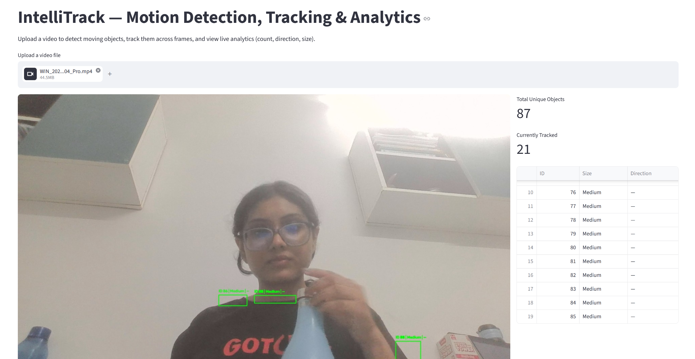
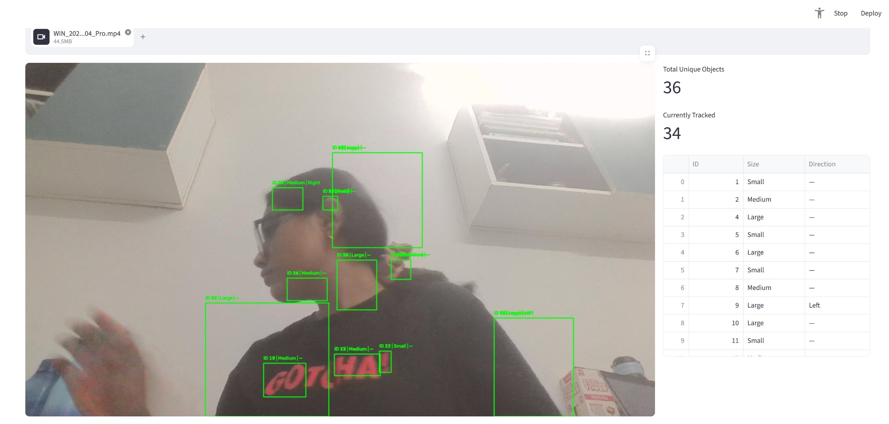

# IntelliTrack — Motion Detection, Tracking & Analytics

## Overview
IntelliTrack is a computer vision system that detects moving objects in video footage,
tracks them across frames with persistent IDs, and generates real-time analytics
(count, direction, size) — all through an interactive Streamlit dashboard.

## Features
- Real-time motion detection (MOG2 background subtraction)
- Centroid-based object tracking with persistent IDs
- Direction detection (left/right movement)
- Size classification (Small/Medium/Large)
- Live analytics dashboard (Streamlit)

## Technologies Used
- Python 3.x
- OpenCV
- NumPy
- Streamlit
- Pandas

## Installation & Setup

1. Clone the repository:

    git clone https://github.com/Divyanka2005/IntelliTrack.git
    cd IntelliTrack

2. Create and activate a virtual environment:

    python -m venv venv
    .\venv\Scripts\Activate.ps1

3. Install dependencies:

    pip install -r requirements.txt

## Running the App

    streamlit run app.py

Then open `http://localhost:8501` in your browser.

## Testing

    python -m tests.test_detector
    
## Screeshots

## Project Structure

    IntelliTrack/
    ├── src/            # Core modules (detection, tracking, analytics)
    ├── app.py          # Streamlit UI
    ├── data/           # Sample videos and logs
    ├── docs/           # Design diagrams
    ├── tests/          # Unit tests
    └── report/         # Final project report